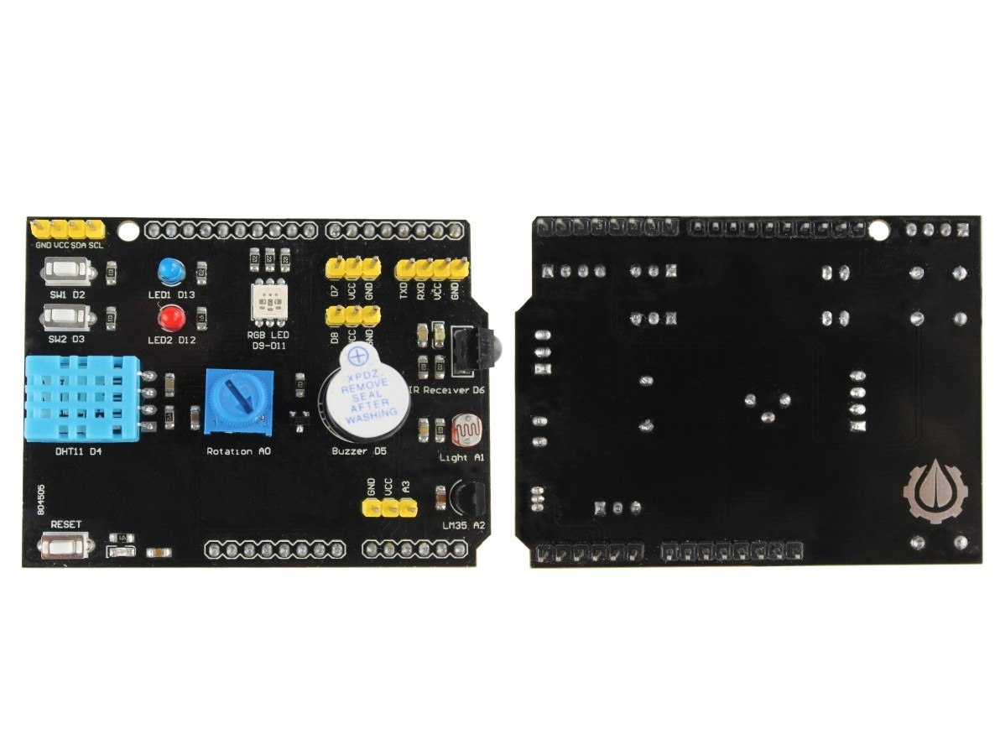
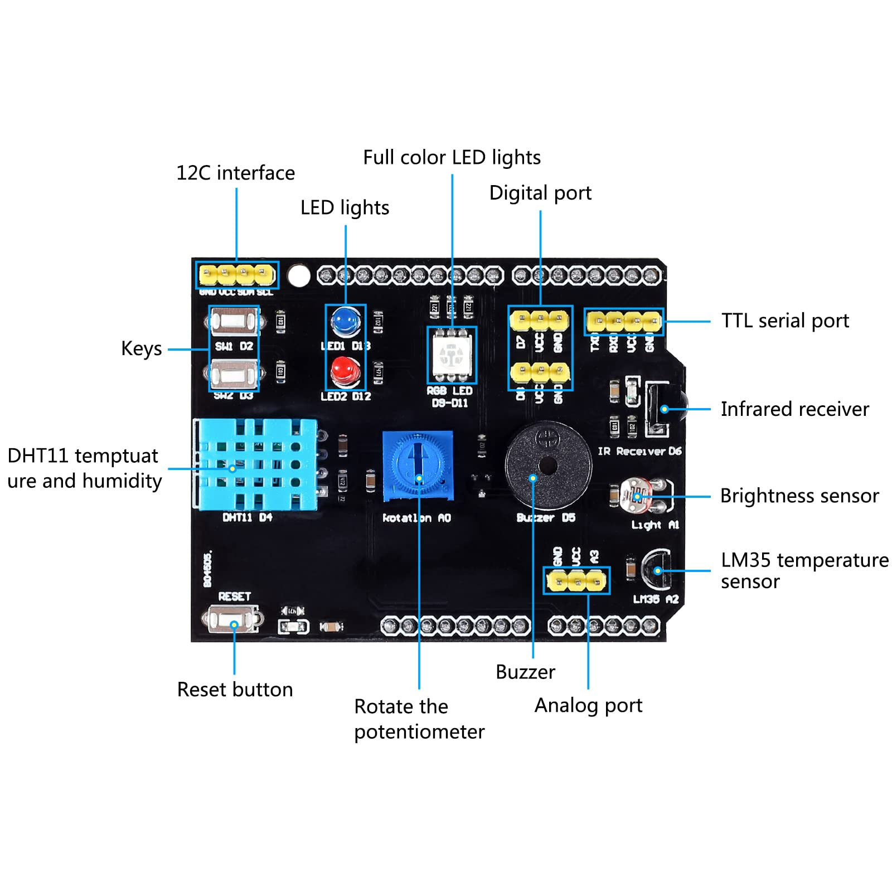

# Shield Multifunção 9 em 1 (UNO)

## Visão geral
Shield de aprendizado no formato Arduino UNO que reúne 9 periféricos em uma
única placa: 2 botões, 2 LEDs, LED RGB, sensor DHT11, buzzer, receptor
infravermelho, potenciômetro, LDR e sensor de temperatura LM35. Encaixa
direto sobre a placa, sem protoboard e sem fios, o que o torna ideal para
aulas introdutórias de entradas/saídas digitais, leitura analógica, PWM e
sensores.

Também traz barras de pinos para expansão: I2C, serial TTL, digitais livres
(D7, D8) e um analógico livre (A3), além do botão RESET repetido.

## Tensão de operação
| | |
|---|---|
| Tensão lógica | **5V** |
| Alimentação | pino 5V do header da placa (não tem alimentação própria) |
| Sensores que exigem 5V | LM35 (opera de 4V a 30V; não funciona em 3,3V) |

> ⚠️ **Shield de 5V.** Use apenas em placas cuja lógica seja 5V. Em uma
> placa de 3,3V, as entradas do microcontrolador recebem 5V (botões,
> DHT11, receptor IR) e podem queimar.
>
> **A confirmar com multímetro:** que o `VCC` das barras de pinos do
> shield está ligado ao pino 5V (e não ao 3,3V) do header. Meça entre
> `VCC` e `GND` com o shield encaixado em uma placa ligada.

## Compatibilidade com placas

| Placa | Lógica | Compatível? | Observações |
|-------|--------|-------------|-------------|
| [Arduino UNO R3](../../boards/arduino-uno-r3/README.md) (ATmega328P) | 5V | ✅ Sim | Placa-alvo original do shield. Até 20 mA por pino. ADC de 10 bits. |
| [Arduino UNO R4 Minima / WiFi](../../boards/arduino-uno-r4/README.md) (Renesas RA4M1) | 5V | ✅ Sim | Mesmo formato e pinagem. **Corrente máxima de 8 mA por pino** (menor que a do R3). ADC de 10 bits por padrão, configurável até 14 bits com `analogReadResolution()`. |
| ESP32-S3 N16R8 DevKit e outras placas de 3,3V | 3,3V | ❌ Não | Risco de queimar os GPIOs. Ver [ESP32-S3 N16R8](../../boards/esp32-s3-n16r8/README.md). |

## Fotos

## Diagrama esquemático / Pinout

| Pino | Periférico | Serigrafia na placa |
|------|------------|---------------------|
| D2 | Botão SW1 | `SW1 D2` |
| D3 | Botão SW2 | `SW2 D3` |
| D4 | Sensor de temperatura e umidade DHT11 | `DHT11 D4` |
| D5 | Buzzer | `Buzzer D5` |
| D6 | Receptor infravermelho (IR) | `IR Receiver D6` |
| D9, D10, D11 | LED RGB (um pino por cor) | `RGB LED D9-D11` |
| D12 | LED 3 mm vermelho | `LED2 D12` |
| D13 | LED 3 mm azul | `LED1 D13` |
| A0 | Potenciômetro | `Rotation A0` |
| A1 | LDR (sensor de luminosidade) | `Light A1` |
| A2 | Sensor de temperatura LM35 | `LM35 A2` |

### Pinos livres / expansão

| Conector | Pinos |
|----------|-------|
| Digital | `D7 VCC GND` e `D8 VCC GND` |
| Analógico | `GND VCC A3` |
| I2C | `GND VCC SDA SCL` |
| Serial TTL | `TXD RXD VCC GND` |

> **Atenção:** D13 também é o LED embutido do UNO (`LED_BUILTIN`), então o
> LED azul acende junto com ele. D9–D11 são pinos PWM, o que permite variar
> as cores do LED RGB com `analogWrite()`. O serial TTL usa os pinos D0/D1. No
> UNO R3, eles são a mesma porta da USB: evite usá-los com o Monitor Serial
> aberto. No UNO R4, o serial TTL é o `Serial1`, independente da USB.

## Componentes principais
- 2 botões táteis (SW1, SW2)
- 2 LEDs de 3 mm (vermelho e azul)
- 1 LED RGB SMD
- Sensor de temperatura e umidade DHT11
- Buzzer
- Receptor infravermelho (IR)
- Potenciômetro (trimpot)
- LDR (fotoresistor)
- Sensor de temperatura LM35
- Botão RESET

## Funcionalidades / Periféricos
- Entradas digitais: botões (D2, D3)
- Saídas digitais: LEDs (D12, D13) e buzzer (D5)
- PWM: LED RGB (D9, D10, D11)
- Entradas analógicas: potenciômetro (A0), LDR (A1), LM35 (A2)
- Sensor digital de um fio: DHT11 (D4)
- Recepção de controle remoto IR (D6)
- Expansão: I2C, serial TTL, D7, D8 e A3

## Código de teste e validação
O sketch [`code/teste_shield_9em1`](code/teste_shield_9em1/teste_shield_9em1.ino)
testa os 9 periféricos por um menu no Monitor Serial (9600 baud, final de
linha "Nova linha"). Compila no UNO R3 e no UNO R4 (Minima e WiFi) e não
precisa de bibliotecas externas. Instruções, resultado esperado de cada
teste e problemas comuns: [`code/README.md`](code/README.md).

### A confirmar com o shield em mãos
Detalhes que variam entre lotes e que o sketch de teste ajuda a descobrir:

| Item | Como descobrir | Resultado |
|------|----------------|-----------|
| Cor ligada a D9, D10 e D11 | Teste 2, parte A | _a preencher_ |
| LED RGB: cátodo ou ânodo comum | Teste 2, parte B | _a preencher_ |
| Buzzer: ativo ou passivo, e nível que liga | Teste 4 | _a preencher_ |
| Botões: pull-up ou pull-down | Teste 3 (nível de repouso) | _a preencher_ |
| LDR: leitura sobe ou desce com mais luz | Teste 6 | _a preencher_ |
| `VCC` das barras de pinos = 5V | Multímetro | _a preencher_ |

## Referências
- Placas compatíveis (com datasheets dos microcontroladores):
  [UNO R3](../../boards/arduino-uno-r3/README.md) e
  [UNO R4](../../boards/arduino-uno-r4/README.md)
- Pinagem levantada a partir da serigrafia da placa e das imagens em
  `imagens/`.
