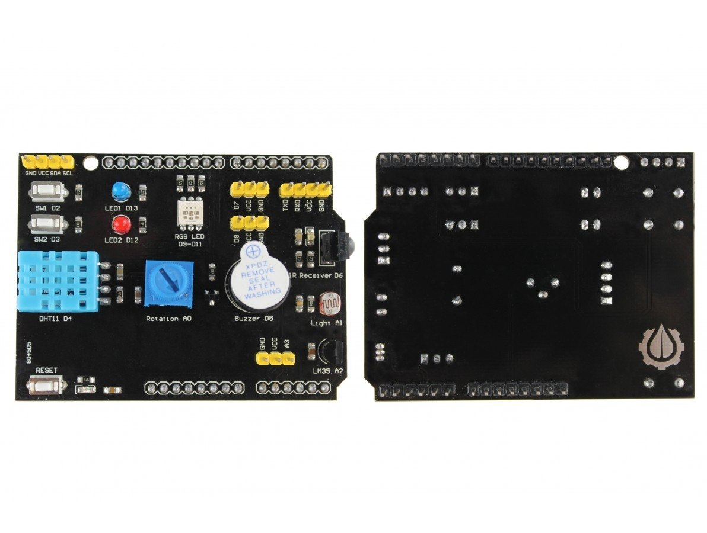
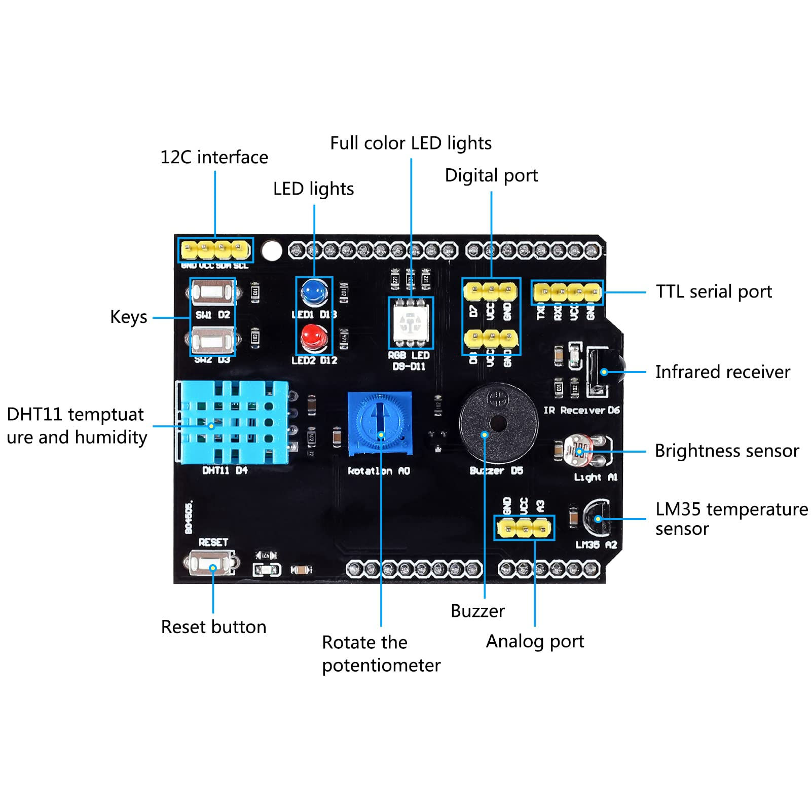

# Shield Multifunção 9 em 1 (UNO)

## Visão geral
Shield de aprendizado no formato Arduino UNO que reúne 9 periféricos em uma
única placa: 2 botões, 2 LEDs, LED RGB, sensor DHT11, buzzer, receptor
infravermelho, potenciômetro, LDR e sensor de temperatura LM35. Encaixa
direto sobre a placa, sem protoboard e sem fios, o que o torna ideal para
aulas introdutórias de entradas/saídas digitais, leitura analógica, PWM e
sensores.

Também traz barras de pinos para expansão: I2C, serial TTL, digitais livres
(D7, D8) e um analógico livre (A3), além do botão RESET repetido.

O projeto original é o **Keyestudio Easy Module Shield V1** (código KS0183,
também vendido como "Multi-purpose Shield V1"). O shield 9 em 1 vendido
genericamente é um clone dele, com o mesmo layout e a mesma pinagem, por
isso a [documentação da Keyestudio](https://wiki.keyestudio.com/Ks0183_keyestudio_Multi-purpose_Shield_V1) vale para ele.

## Tensão de operação
| | |
|---|---|
| Tensão lógica | **5V** |
| Alimentação | pino 5V do header da placa, o que fica ao lado do 3,3V (não tem alimentação própria). ✅ Medido |
| Pino 3,3V do header | passa pelo shield, mas **não está ligado a nenhum componente**. ✅ Medido |
| Pino IOREF do header | **não está ligado a nada**. ✅ Medido |
| Sensores que exigem 5V | LM35 (opera de 4V a 30V; não funciona em 3,3V) |

> ⚠️ **Shield de 5V.** Use apenas em placas cuja lógica seja 5V. Em uma
> placa de 3,3V, as entradas do microcontrolador recebem 5V e podem
> queimar. As medições abaixo mostram por onde o 5V chega a cada pino.

### Medições do circuito (2026-10-01)

Feitas com multímetro, com o **shield solto e sem alimentação**. As
resistências foram medidas com os componentes na placa, então somam
caminhos em paralelo: são aproximadas. O valor nominal de cada resistor
não foi lido.

**Barramento `VCC`:** o pino 5V do header tem continuidade com o `VCC` de
todas as barras de expansão (D7, D8, A3, I2C e serial TTL), com o LDR, com
o LM35 e com o potenciômetro. Não há continuidade entre 5V e 3,3V. A
resistência entre 5V e GND fica entre ≈5 e 10 kΩ e varia com a luz sobre o
LDR (5,2 kΩ com luz e 6,2 kΩ com o LDR coberto, numa mesma rodada).

| Pino | Periférico | Circuito encontrado | Como foi medido |
|------|------------|---------------------|-----------------|
| D2, D3 | Botões SW1, SW2 | **Pull-up de ≈10 kΩ para o 5V.** O botão liga o pino ao GND: **ativo em LOW** | Pino↔5V: 10 kΩ solto. Pino↔GND: 0 Ω apertado |
| D4 | DHT11 | **Pull-up de ≈3,3 kΩ para o 5V** | D4↔5V: 3,2 kΩ |
| D5 | Buzzer | Base de um transistor **NPN** (por resistor). Montagem exata (emissor no GND ou seguidor de emissor) não determinada | Modo diodo, ponta vermelha no D5: conduz para o GND (1,79V) e para o 5V (1,15V); inverso aberto. Código SMD do transistor ilegível |
| D6 | Receptor IR | **Pull-up de ≈10 kΩ para o 5V** (na placa ou dentro do receptor) | D6↔5V: 10 kΩ |
| A0 | Potenciômetro | Divisor entre 5V e GND. **Todo para a esquerda, A0 fica ligado direto ao 5V**; todo para a direita, ao GND | A0↔5V: 0,6 Ω (esquerda). A0↔GND: 0,5 Ω (direita) |
| A1 | LDR | LDR entre o 5V e o A1: **a tensão em A1 sobe com a luz** | A1↔5V: 1,4 kΩ com luz, 5,5 kΩ coberto |

**A confirmar com o shield ligado** (num Arduino UNO): tensão no 5V, em
D2/D3 (solto e apertado), D4 e D6 em repouso, A0 nos dois extremos, A1
coberto e com luz forte, e o nível (HIGH ou LOW) que faz o buzzer tocar.

## Compatibilidade com placas

| Placa | Lógica | Compatível? | Observações |
|-------|--------|-------------|-------------|
| [Arduino UNO R3](../../boards/arduino-uno-r3/README.md) (ATmega328P) | 5V | ✅ Sim | Placa-alvo original do shield. Até 20 mA por pino. ADC de 10 bits. |
| [Arduino UNO R4 Minima / WiFi](../../boards/arduino-uno-r4/README.md) (Renesas RA4M1) | 5V | ✅ Sim | Mesmo formato e pinagem. **Corrente máxima de 8 mA por pino** (menor que a do R3). ADC de 10 bits por padrão, configurável até 14 bits com `analogReadResolution()`. |
| Arduino Mega 2560 | 5V | ✅ Segundo a Keyestudio | Não testado aqui. Os pinos D2–D13 e A0–A3 coincidem com os do UNO. |
| [ESP32-S3 UNO](../../boards/esp32-s3-uno/README.md) | 3,3V | ❌ Não, sem modificação | Encaixa perfeitamente, mas o shield leva 5V aos GPIOs: pelos pull-ups em D2, D3, D4 e D6 e **direto** pelo potenciômetro em A0 (ver "Medições do circuito"). Modificação em estudo, ver abaixo. |
| ESP32-S3 N16R8 DevKit e outras placas de 3,3V | 3,3V | ❌ Não | Risco de queimar os GPIOs. Ver [ESP32-S3 N16R8](../../boards/esp32-s3-n16r8/README.md). |

### Modificação para 3,3V (em estudo, não testada)

Ideia: desligar o pino 5V do header do shield e ligar o barramento `VCC` ao
pino 3,3V do header. Assim, todos os pull-ups e divisores passam a ir para
3,3V. É viável porque o pino 3,3V do shield não está ligado a nada e não há
curto entre 5V e 3,3V (medido). Consequências previstas:

- O **LM35 deixa de funcionar** (exige ≥4V).
- O **receptor IR** precisa aceitar 3,3V. Depende do modelo, que ainda não
  foi identificado: o VS1838B aceita de 2,7 a 5,5V.
- O DHT11 aceita 3,3V. O buzzer e o LED de alimentação devem ficar mais
  fracos.
- O shield modificado deixa de ser um shield de 5V: etiquete-o. Prefira
  uma forma reversível (dessoldar o pino 5V, ou um jumper seletor 5V/3,3V)
  a cortar o pino.

Antes de fazer, verificar se o pino **AREF** do shield está ligado a algo:
na ESP32-S3 UNO, a posição AREF está ligada ao reset da placa.

## Fotos

## Diagrama esquemático / Pinout

| Pino | Periférico | Serigrafia na placa |
|------|------------|---------------------|
| D2 | Botão SW1 | `SW1 D2` |
| D3 | Botão SW2 | `SW2 D3` |
| D4 | Sensor de temperatura e umidade DHT11 | `DHT11 D4` |
| D5 | Buzzer | `Buzzer D5` |
| D6 | Receptor infravermelho (IR) | `IR Receiver D6` |
| D9 | LED RGB — vermelho | `RGB LED D9-D11` |
| D10 | LED RGB — azul | `RGB LED D9-D11` |
| D11 | LED RGB — verde | `RGB LED D9-D11` |
| D12 | LED 3 mm vermelho | `LED2 D12` |
| D13 | LED 3 mm azul | `LED1 D13` |
| A0 | Potenciômetro | `Rotation A0` |
| A1 | LDR (sensor de luminosidade) | `Light A1` |
| A2 | Sensor de temperatura LM35 | `LM35 A2` |

### Pinos livres / expansão

| Conector | Pinos |
|----------|-------|
| Digital | `D7 VCC GND` e `D8 VCC GND` |
| Analógico | `GND VCC A3` |
| I2C | `GND VCC SDA SCL` |
| Serial TTL | `TXD RXD VCC GND` |

> **Atenção:** D13 também é o LED embutido do UNO (`LED_BUILTIN`), então o
> LED azul acende junto com ele. D9–D11 são pinos PWM, o que permite variar
> as cores do LED RGB com `analogWrite()`. O serial TTL usa os pinos D0/D1. No
> UNO R3, eles são a mesma porta da USB: evite usá-los com o Monitor Serial
> aberto. No UNO R4, o serial TTL é o `Serial1`, independente da USB.

## Componentes principais
- 2 botões táteis (SW1, SW2)
- 2 LEDs de 3 mm (vermelho e azul)
- 1 LED RGB SMD
- Sensor de temperatura e umidade DHT11
- Buzzer passivo, acionado por transistor (segundo a Keyestudio)
- Receptor infravermelho (IR)
- Potenciômetro (trimpot)
- LDR (fotoresistor)
- Sensor de temperatura LM35 (LM35D, faixa de 0 a 100 °C, segundo a Keyestudio)
- Botão RESET e LED de alimentação

## Funcionalidades / Periféricos
- Entradas digitais: botões (D2, D3)
- Saídas digitais: LEDs (D12, D13) e buzzer (D5)
- PWM: LED RGB (D9 vermelho, D10 azul, D11 verde)
- Entradas analógicas: potenciômetro (A0), LDR (A1), LM35 (A2)
- Sensor digital de um fio: DHT11 (D4)
- Recepção de controle remoto IR (D6)
- Expansão: I2C, serial TTL, D7, D8 e A3

## Código de teste e validação
O sketch [`code/teste_shield_9em1`](code/teste_shield_9em1/teste_shield_9em1.ino)
testa os 9 periféricos por um menu no Monitor Serial (9600 baud, final de
linha "Nova linha"). Compila no UNO R3 e no UNO R4 (Minima e WiFi) e não
precisa de bibliotecas externas. Instruções, resultado esperado de cada
teste e problemas comuns: [`code/README.md`](code/README.md).

No **UNO R4**, os sketches dedicados da placa também testam o shield,
quando ele está encaixado: um **automático** (botões e IR em repouso,
saídas D9–D13, DHT11, LM35, LDR) e um **interativo** (guiado, com
botões, potenciômetro, LED RGB, buzzer, LDR, DHT11 e IR). Ver
[Código de teste do UNO R4](../../boards/arduino-uno-r4/README.md#código-de-teste-e-validação).

### A confirmar com o shield em mãos
Detalhes que variam entre lotes e que o sketch de teste ajuda a descobrir.
A coluna "Indício" vem da documentação de dois fabricantes desta mesma
placa: a [Keyestudio](https://wiki.keyestudio.com/Ks0183_keyestudio_Multi-purpose_Shield_V1) (projeto original) e a
[RoboticX](https://github.com/RoboticXps/nine-in-one-expansion-sensor-board-arduino) (exemplos de código). É um bom ponto de partida, mas não
substitui a medição: clones podem trocar componentes. Confirme com o teste.

| Item | Como descobrir | Indício (documentação dos fabricantes) | Resultado |
|------|----------------|----------------------------------------|-----------|
| LEDs D12 e D13: nível que acende | Teste 1 | HIGH acende (Keyestudio e RoboticX) | ✅ Ativos em HIGH (confirmado na placa) |
| LED RGB: cátodo ou ânodo comum | Teste 2, parte B | Cátodo comum: a cor acende com o pino em HIGH (Keyestudio e RoboticX) | ✅ Ativo em HIGH, cátodo comum (confirmado na placa) |
| Cor ligada a D9, D10 e D11 | Teste 2, parte A | D9 = vermelho, D10 = verde, D11 = azul (Keyestudio e RoboticX) | ✅ **D9 = vermelho, D10 = azul, D11 = verde** (confirmado na placa; **difere** da documentação dos fabricantes) |
| Buzzer: ativo ou passivo, e nível que liga | Teste 4 | **Passivo, liga em LOW** (Keyestudio: "passive buzzer"; no código, LOW = som e HIGH = silêncio, o que indica transistor PNP) | ⚠️ Multímetro (2026-10-01): transistor **NPN**, o que **diverge** do indício de PNP. Nível que liga: _a preencher_ (Teste 4) |
| Botões: pull-up ou pull-down | Teste 3 (nível de repouso) | Pull-down: o exemplo da RoboticX trata o botão apertado como HIGH. O da Keyestudio usa interrupção por borda de descida, que funciona nos dois casos e não confirma nada | ✅ **Pull-up de ≈10 kΩ, ativo em LOW** (multímetro, 2026-10-01; **difere** do exemplo da RoboticX). Falta ver no Teste 3 |
| LDR: leitura sobe ou desce com mais luz | Teste 6 | **Sobe com a luz** (Keyestudio: "the stronger the light is, the greater the value is") | Multímetro indica que **sobe** (LDR entre 5V e A1). Falta ver no Teste 6 |
| `VCC` das barras de pinos = 5V | Multímetro | Não indicado | ✅ Ligado ao pino 5V do header (continuidade, 2026-10-01). Falta medir a tensão com o shield ligado |
| LM35: temperatura coerente | Teste automático do UNO R4; multímetro entre A2 e GND | 10 mV/°C, 0,25 V a 25 °C | ⚠️ **Lê ~0,45–0,49 V (≈45–49 °C) com o DHT11 marcando 26 °C** (UNO R4, 2026-10-03). Ligação conferida visualmente. Com a referência interna de 1,43 V: 0,446 V; com a AVCC (4,78 V): 0,489 V. Lido logo depois do A1 (LDR), sobe para ~0,61 V e fica alto, o que sugere o LM35 oscilando (o datasheet avisa que ele oscila com carga capacitiva). **Falta medir o A2 com multímetro** para separar defeito do sensor de erro de leitura |
| DHT11: 1ª leitura depois de ligar | Teste automático do UNO R4 | Não indicado | ✅ Vem **zerada** (0 °C, 0 %) e passa na soma de verificação (0+0+0+0 = 0). Os sketches descartam essa leitura (2026-10-03) |

## Referências
- Placas compatíveis (com datasheets dos microcontroladores):
  [UNO R3](../../boards/arduino-uno-r3/README.md) e
  [UNO R4](../../boards/arduino-uno-r4/README.md)
- Keyestudio KS0183 (projeto original deste shield): wiki com pinagem,
  sketch de teste e resultados esperados: https://wiki.keyestudio.com/Ks0183_keyestudio_Multi-purpose_Shield_V1
  - Código e bibliotecas: https://fs.keyestudio.com/KS0183
- Exemplos do fabricante (RoboticX) para esta placa, um sketch por
  periférico: https://github.com/RoboticXps/nine-in-one-expansion-sensor-board-arduino
  (o exemplo do DHT11 usa a biblioteca `DHT sensor library` da Adafruit)
- Pinagem levantada a partir da serigrafia da placa e das imagens em
  `imagens/`.

---

**Autor:** Prof. Joao Miguel Roehe ([@professorjoaomiguel](https://github.com/professorjoaomiguel)). Documentação sob licença [CC BY-NC 4.0](https://creativecommons.org/licenses/by-nc/4.0/deed.pt-br); código em `code/` sob licença MIT. Veja como citar no [README principal](../../README.md).
